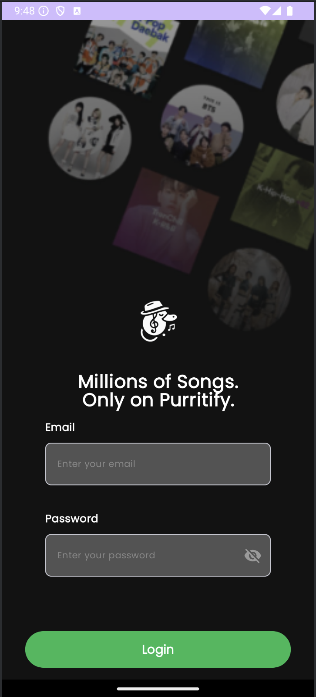
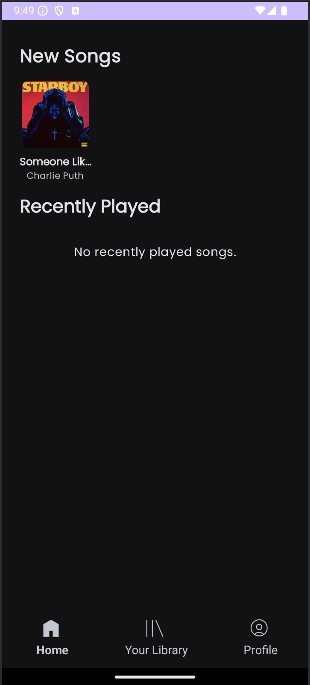

# Purrytify

## Tugas Besar 1 IF3210 - Pengembangan Aplikasi Piranti Bergerak

## Deskripsi Aplikasi

Purrytify merupakan sebuah aplikasi android native yang dikembangkan dengan bahasa pemrograman Kotlin. Aplikasi ini menyediakan berbagai fungsionalitas terkait music player dengan tampilan berbasis Jetpack Compose.

### Spesifikasi SDK

- Minimum SDK: Android 10 (API Level 29)
- Target SDK: Android 13 (API Level 34)
- Compile SDK: Android 13 (API Level 34)

### Fitur Utama

1. Log in ke sebuah akun yang sudah terdaftar
2. Melihat profil pengguna yang berisi identitas, banyak lagu yang dimiliki, banyak lagu yang disukai, dan banyak lagu yang sudah didengarkan
3. Memasukkan lagu ke library berdasarkan akun yang terautentikasi
4. Mengatur playlist lagu berdasarkan daftar lagu yang ada pada library, liked song, recently played, atau newly added
5. Pemutar lagu dengan fitur seek to, play/pause, next/previous, shuffle, repeat one/all, like, dan edit song
6. Mini player dengan fitur seek to, play/pause, dan like song
7. Background service untuk melakukan reautentikasi ketika JWT kadaluarsa
8. Network sensing untuk mendeteksi kehilangan sinyal pada saat menggunakan aplikasi
9. Notification untuk menampilkan lagu yang sedang diputar sekaligus player control
10. Top songs untuk melihat top 50 lagu global dan top 10 lagu di negara lokasi pengguna
11. Download online songs untuk mengunduh lagu-lagu yang ada pada top songs 

## Daftar Library

1. Hilt untuk dependency injection
2. Jetpack Compose untuk UI
3. MediaPlayer dari Android SDK untuk pemutar lagu
4. Room Database untuk penyimpanan aplikasi
5. Coil untuk image loading
6. Retrofit & OkHTTP untuk pemanggilan API
7. Datastore untuk menyimpan JWT
8. Android SDK + Kotlin Coroutine untuk network sensing
9. WorkManager untuk refresh JWT

## Screenshot Aplikasi

### Layar Log-In

### Layer Home

### Layar Library

### Layar Profile

### Layar Media Player

### Mini Player

### Layer Add Song

### Tampilan No Internet

## Pembagian Kerja

| NIM      | Nama                    | Pekerjaan                                                                                         |
|----------|-------------------------|---------------------------------------------------------------------------------------------------|
| 13522122 | Maulvi Ziadinda Maulana | UI Login, UI Home, UI Profile, Authentication Logic, Worker Service, Song with Owner Feature      |
| 13522144 | Nicholas Reymond Sihite | UI Library, UI Navigation Bar, Audio Service, Player Manager, UI Mini Player, Network Sensing (logic + UI), Notification, Top Songs, Download Online Songs |
| 13522153 | Muhammad Fauzan Azhim   | UI Player, Add Songs, Player View Model, RoomDatabase, Edit songs                                 |

## Durasi Persiapan dan Pengerjaan

| NIM      | Pekerjaan                      | Durasi Persiapan | Durasi Pengerjaan |
|----------|--------------------------------|------------------|-------------------|
| 13522122 | Login Screen                   | 1 jam            | 5 jam             |
|          | Auth Logic                     | 1 jam            | 4 jam             |
|          | Profile Screen                 | 1 jam            | 4 jam             |
|          | Home Screen                    | 1 jam            | 6 jam             |
|          | WorkManager                    | 1 jam            | 3 jam             |
| 13522144 | UI Library                     | 1 jam            | 5 jam             |
|          | UI Navigation Bar              | 1 jam            | 2 jam             |
|          | Audio Service, Player Manager  | 1 jam            | 10 jam            |
|          | UI Mini Player                 | 1 jam            | 5 jam             |
|          | Network Sensing                | 1 jam            | 2 jam             |
|          | Notification                   | 1 jam            | 8 jam             |
|          | Top Songs                      | 1 jam            | 8 jam             |
|          | Download Online Songs          | 1 jam            | 5 jam             |
| 13522153 | UI Player                      | 1 jam            | 2 jam             |
|          | Add Songs                      | 1 jam            | 8 jam             |
|          | Player View Model              | 1 jam            | 3 jam             |
|          | RoomDatabase                   | 1 jam            | 4 jam             |
|          | Edit songs                     | 1 jam            | 4 jam             |
